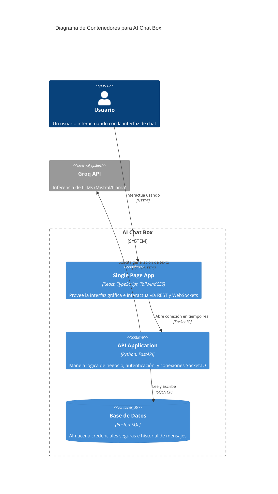

# Arquitectura del Sistema: AI Chat Box

## 1. Decisiones de Arquitectura (ADR - Architecture Decision Records)

*   **Estilo Arquitectónico:** Monolito Modular en Backend (con separación por dominios: usuarios, chat, ia) y Single Page Application (SPA) en Frontend.
*   **Protocolos de Comunicación:**
    *   **HTTP/REST:** Para autenticación (Login/Registro) y operaciones estáticas (obtener historial antiguo).
    *   **WebSockets (Socket.IO):** Para la comunicación bidireccional de baja latencia durante el chat en tiempo real.
*   **Base de Datos:** PostgreSQL (Relacional) para garantizar la integridad de las relaciones entre Usuarios y Mensajes.
*   **Integración Externa:** Groq API para LLM inference.

## 2. Diagrama de Contenedores (C4 Model - Nivel 2)

## 3. Patrones de Diseño a utilizar

*   **Repository Pattern:** En el backend, las consultas a base de datos estarán separadas de la lógica de negocio (FastAPI routers).
*   **Dependency Injection (DI):** Usaremos la inyección de dependencias nativa de FastAPI para instanciar repositorios y sesiones de base de datos.
*   **Zustand (State Management):** En el frontend, el estado global (usuario logueado, lista de mensajes actuales) se manejará con stores de Zustand.
